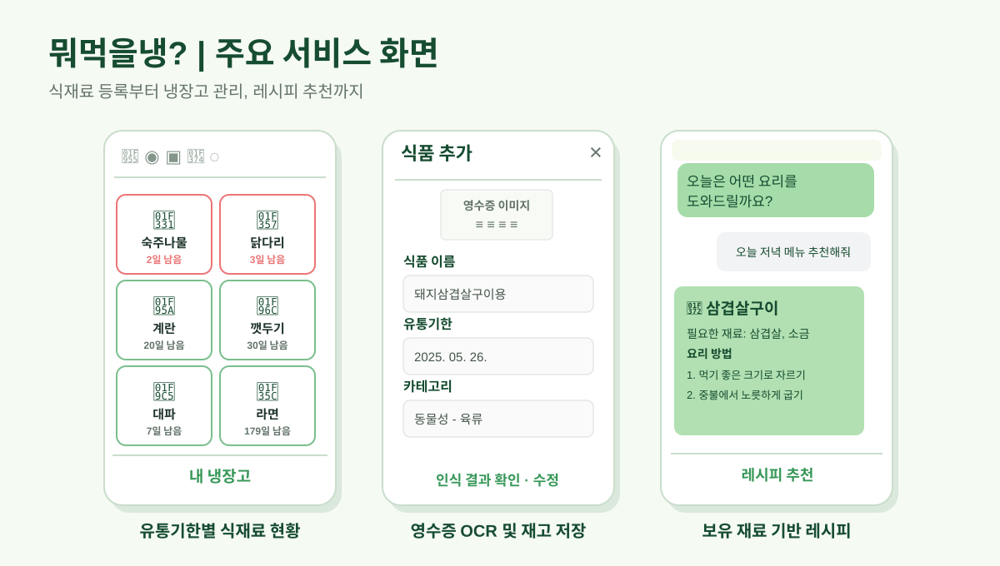
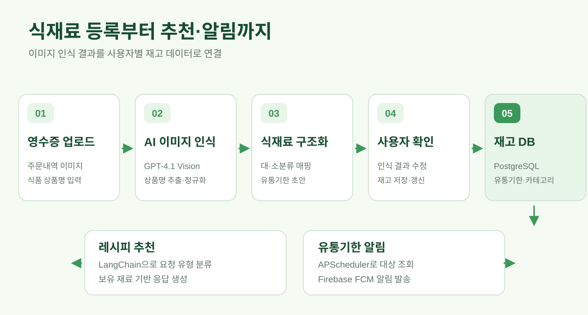
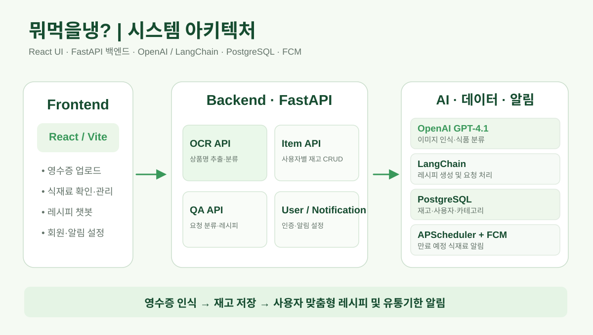

# 뭐먹을냉? | AI 기반 냉장고 재고관리 및 레시피 추천 서비스

> 영수증 사진 한 장으로 식재료 등록의 번거로움을 줄이고, 보유 재료를 활용한 레시피 추천과 유통기한 알림까지 연결한 AI 식재료 관리 서비스

## 1. 프로젝트 소개

냉장고에 어떤 식재료가 있는지 기억하기 어렵고, 재료를 하나씩 등록하는 과정이 번거로우면 재고관리 서비스를 꾸준히 사용하기 어렵습니다. 유통기한을 놓쳐 식재료를 버리거나, 이미 있는 재료를 활용하지 못하는 문제도 발생합니다.

**뭐먹을냉?**은 이러한 불편을 해결하기 위해 **영수증 이미지 인식 → 식재료 추출·분류 → 사용자 확인 및 재고 저장 → 보유 재료 기반 레시피 추천 → 유통기한 알림**을 하나의 흐름으로 연결한 서비스입니다.

LLM을 대화 기능에만 사용하지 않고, 이미지에서 추출한 비정형 상품명을 식재료 데이터로 변환하고 실제 데이터베이스에 저장하는 과정에 적용했습니다.

| 항목 | 내용 |
| --- | --- |
| 개발 기간 | 2025년 4~5월 (약 6주) |
| 프로젝트 | SeSAC LLM 앱 개발자 과정 팀 프로젝트 |
| 담당 역할 | 팀장 / 백엔드 개발 / OCR·LLM 기능 연동 |
| 핵심 기술 | Python, FastAPI, PostgreSQL, SQLAlchemy, Alembic, OpenAI GPT-4.1, LangChain, Firebase FCM, APScheduler |

## 2. 핵심 기능

주요 화면은 냉장고 재고 확인, 영수증 인식 후 식품 등록, 보유 재료 기반 레시피 추천으로 구성됩니다.

### ① 영수증 기반 식재료 자동 등록
- 영수증 또는 주문내역 이미지 업로드
- GPT-4.1 이미지 입력으로 식재료 상품명 추출 및 일반 식재료명으로 정규화
- 추출한 재료를 대분류·소분류로 분류하고 일반적인 보관기간을 참고한 유통기한 초안 생성
- 사용자가 항목 및 유통기한을 확인·수정한 후 재고에 저장

### ② 냉장고 재고관리
- 사용자별 식재료, 식품 카테고리 및 유통기한 관리
- 재고 조회·삭제 및 항목 저장 API
- 동일 식재료의 중복 등록 문제를 줄이기 위한 upsert 처리

### ③ 보유 재료 기반 레시피 추천
- PostgreSQL에 저장된 사용자 보유 재료를 바탕으로 레시피 생성
- LangChain을 이용해 요청 유형을 분류하고 적절한 추천 로직으로 연결
- 요리명, 식재료, 음식 종류 등 사용자 요청에 따른 추천
- 필요한 재료 및 부족한 재료 정보를 함께 제공하도록 프롬프트 구성

### ④ 유통기한 알림
- Firebase Cloud Messaging(FCM)을 통한 사용자별 푸시 알림
- APScheduler의 정기 작업으로 **유통기한 3일 전** 대상 식재료 조회
- 사용자의 알림 설정 및 등록된 FCM 토큰에 따라 알림 발송

## 3. 서비스 처리 흐름

~~~text
영수증 / 주문내역 이미지
          │
          ▼
   GPT-4.1 이미지 분석
          │
          ▼
  상품명 추출 및 정규화
          │
          ▼
 식재료 분류 / 유통기한 초안
          │
          ▼
    사용자 확인·수정
          │
          ▼
  FastAPI → PostgreSQL
          │
     ┌────┴─────┐
     ▼          ▼
 보유 재료 조회   유통기한 확인
     │          │
     ▼          ▼
 LangChain      APScheduler
 레시피 추천     + Firebase FCM
     │          │
     ▼          ▼
 추천 결과 제공   만료 예정 알림
~~~

## 4. 시스템 구성 및 기술적 구현

- **OCR 결과 구조화:** 상품명 추출과 카테고리·유통기한 분류 단계를 분리하고, LLM 응답을 JSON 형태로 파싱하여 API에서 활용할 수 있도록 구성했습니다.
- **데이터 흐름 연결:** 이미지 분석 결과가 사용자 확인을 거쳐 재고 DB에 저장되고, 같은 데이터가 레시피 추천과 알림 기능에 활용되도록 API 및 데이터 구조를 설계했습니다.
- **유저별 재고 관리:** 사용자·식재료·카테고리 관계를 SQLAlchemy 모델로 정의하고 Alembic으로 DB 변경 이력을 관리했습니다.
- **요청 유형별 추천:** 사용자 질문을 분류한 뒤 보유 재료 중심 추천, 특정 요리·재료·카테고리 추천 등으로 분기하는 LangChain 기반 로직을 구성했습니다.
- **예약 알림 처리:** 매번 사용자가 앱에 접속하지 않아도 정기 작업으로 만료 예정 식재료를 조회하고 FCM 알림을 발송하도록 구현했습니다.

## 5. 담당 역할 및 기여

**팀장으로 일정과 기능 우선순위를 조율하면서 백엔드·AI 연동을 담당했습니다.**

- 프로젝트 기획, 역할 분담, 개발 일정 및 핵심 기능 우선순위 조율
- 사용자·식재료·카테고리 중심의 PostgreSQL DB 구조와 FastAPI 엔드포인트 설계·구현
- GPT-4.1 기반 영수증 상품명 인식·정규화 및 식재료 분류 API 구현
- 분석 결과를 재고 데이터로 저장·갱신하는 API 처리
- 보유 재료 기반 레시피 추천 프롬프트·라우팅 로직 연동
- 유통기한 알림을 위한 APScheduler·Firebase FCM 연동
- API 명세와 작업 내용을 정리하고 프런트엔드 연결 과정 조율

## 6. 결과 및 배운 점

- 이미지 입력부터 DB 저장, 레시피 추천, 알림까지 연계되는 서비스 핵심 흐름 구현
- 모델 응답을 화면에 표시하는 데 그치지 않고, 실제 서비스에서 재사용할 수 있는 정형 데이터로 변환하는 경험 확보
- 사용자가 AI 추출 결과를 직접 확인·수정하게 함으로써 자동 인식의 오류를 보완하도록 설계

### 한계 및 개선 과제
- 자동 생성되는 유통기한은 식재료의 일반적 보관기간을 참고한 **초안**으로, 개별 제품의 실제 표시기한을 보장하지 않습니다.
- LLM 기반 상품명 추출·분류에는 오인식 가능성이 있어 사용자 확인 과정이 중요합니다.
- 본 저장소는 **FastAPI 백엔드 코드 중심**이며, 프런트엔드 전체 코드가 이 저장소에 포함되어 있지는 않습니다.

## 7. 저장소 구조

| 경로 | 내용 |
| --- | --- |
| [main.py](main.py) | FastAPI 앱 구성 및 정기 알림 스케줄 등록 |
| [domain/ocr/](domain/ocr/) | 영수증 이미지 인식, 식재료 분류 및 저장 API |
| [domain/item/](domain/item/) | 식재료 재고 조회·등록·삭제 기능 |
| [domain/qa/](domain/qa/) | 사용자 요청 분류 및 레시피 추천 |
| [domain/user/](domain/user/) | 회원가입·로그인·계정/알림 설정 |
| [notifications.py](notifications.py) | FCM 알림 및 유통기한 사전 알림 |
| [models.py](models.py) | SQLAlchemy 데이터 모델 |
| [migrations/](migrations/) | Alembic 데이터베이스 마이그레이션 |
